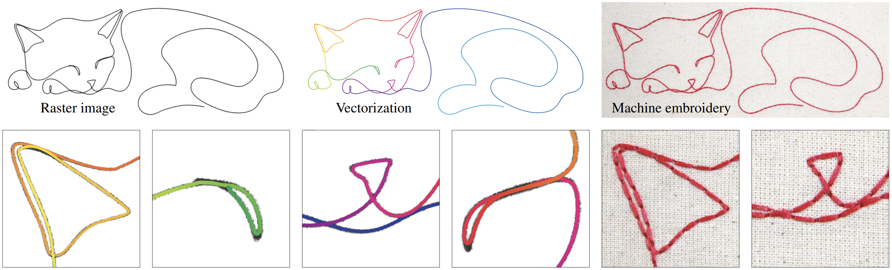

# Single Line Drawing Vectorization




This repository contains the code for the "Single Line Drawing Vectorization" paper. The full paper can be found [here](https://igl.ethz.ch/projects/sld-vectorization/).

## Benchmark

> ⚠️ Due to licensing issues, we are not yet able to release the full benchmark dataset we created for this paper. Samples from this dataset can be found in the `sample` folder.

The benchmark we created to evaluate our method is composed of 56 samples:
- 3 samples available in the `sample/` folder.
- 37 samples from Adobe Stock. Information on how to obtain these can be found in the [benchmark.md](https://github.com/tanguymagne/SLD-Vectorization/blob/main/benchmark.md) file.
- 16 samples licensed from an artist. These are not yet available.

## Installation

Our code requires a Python version between 3.9 and 3.12.
It is recommended to use a Python virtual environment. You can use either `conda` or Python's built-in `venv`.


### Installing the base dependencies

After activating the virtual environment, install the base dependencies:
```bash
pip install -e .
```

### Compiling the C++ code

The largest part of the code is written in pure Python. However, some components are accelerated with C++ code that needs to be compiled. The C++ parts are the voronoi diagram pruning for the medial axis computation and the Vanishing Angle computation for the medial axis pruning.

To compile these two components, simply run:
```bash
sh build.sh
```
Note that this command requires `cmake` to be installed.

### Installing Potrace

Our code requires Potrace to vectorize the outline of the line drawing. The Python version of Potrace can be installed in two different ways.

#### PyPotrace

[PyPotrace](https://github.com/flupke/pypotrace) is a Python package providing bindings to the Potrace library. This is the recommended version to install, as it provides direct bindings to the Potrace C++ library and is thus fast.

To install it, clone [the repo](https://github.com/flupke/pypotrace) and follow the instructions in the `README.md` file.

#### Potracer

If the installation of PyPotrace failed, one can install [Potracer](https://github.com/tatarize/potrace). Potracer is a Python port of Potrace. Since everything is written in Python, the code is much slower, but also easier to install. To install it, simply run:
```bash
pip install potracer
```

Then switch to the `potracer` branch:
```bash
git checkout potracer
```

### Downloading the model

The weights for our intersections classification model need to be downloaded. They can be obtained [here](https://igl.ethz.ch/projects/sld-vectorization/model.pth).
Then the `model.pth` file needs to be placed in the `src/SLDvec/assets/` folder.

## Usage

Once everything is installed, our method can be used either with a command line interface or with the GUI. The GUI allows to interactively influence the algorithm output.

### Command Line Interface

To apply our method to a single image, simply run the command:

```bash
SLDvec run IMAGE_PATH [--output-path [OUTPUT_PATH]] [--thresh [THRESHOLD]] [--multiple-lines]

--image-path            # The path to the input image containing the line drawing.
--output-path           # An optional path to save the SVG output. If not provided, the output will be saved in the same folder as the input.
--thresh                # An optional threshold value to binarize the input image. By default an automatic method is used to determine this threshold. This is the recommended method.
--multiple-lines        # A flag to use if the input image contains multiple strokes.
``` 


To apply the method to a batch of images in a folder, run:
```bash
SLDvec run-folder FOLDER_PATH [--output-dir [OUTPUT_PATH]] [--thresh [THRESHOLD]] [--multiple-lines]

--folder-path           # The path to the input folder containing the line drawings.
--output-dir            # An optional path to save the SVG outputs. If not provided, the outputs will be saved in an output folder inside the input folder.
--thresh                # An optional threshold value to binarize the input images. By default an automatic method is used to determine this threshold. This is the recommended method.
--multiple-lines        # A flag to use if the input images contain multiple strokes.
```

### GUI

The GUI is a web app that can be launched using 
```bash
SLDvec gui [--port PORT] 

--port                # The port on which to launch the web app, by default 5000.
```

The web app will be launched at http://127.0.0.1:5000/ by default.
Information on how to use the GUI can be found at the end of the [supplementary video](https://www.youtube.com/watch?v=Lz056PLrBRE).

## Citation
If you used this code, please consider citing our work:
```
@article{Magne:SLDvectorization:2025,
title = {Single-Line Drawing Vectorization},
author = {Tanguy Magme and Olga Sorkine-Hornung},
journal = {Computer Graphics Forum (proceedings of Pacific Graphics 2025)},
volume = {44},
number = {7},
year = {2025},
url = {https://doi.org/10.1111/cgf.70228},
}
```
